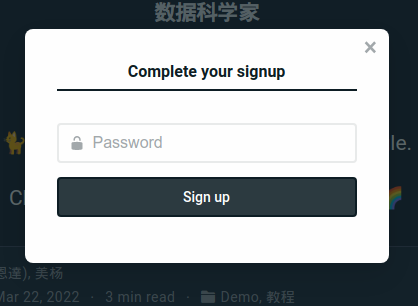

其實 [官方的說明文件](https://wowchemy.com/docs/getting-started/hugo-github-quickstart/) 就寫的很清楚，我這邊也大致上順著帶大家走過一遍，如果有特別需要注意的地方我會再提醒大家～

首先先到 [Wowchemy 的模板選擇](https://wowchemy.com/hugo-themes/)，然後選一個喜歡的模板。我這邊以 *Academic Blog* 示範，點選 *START WITH ACADEMIC BLOG*。

點 Connect to GitHub 來連結到 GitHub 帳號。

如果成功連結的話就會來到這裡。在 Repository name 這邊輸入 blog。Netlify 會自動建立一個 repository，然後點下面的 Save & Deploy。如果你不清楚什麼是 repository 的話也不用擔心，因爲之後 Netlify CMS 會幫我們管理得好好的～

之後就要等它慢慢跑，不過在等的時候可以先點上面這邊的 Domain settings來設定我們的網址！

我們可以看到目前的網址是 eloquent-horse-15a4fb.netlify.app 這團鬼東西 @@ 點右邊的 Options 然後 Edit site name 來把它改掉。如果你已經有自己的網域的話也可以點下面的 Add custom domain 來設定喲~

這邊我輸入 giveanornot，而我的網址則會是https://giveanornot.netlify.app。你可以隨意輸入你想要的網址，不過有只能輸入英數字和橫線（-）的限制哦！

當我們改完了的時候部落格應該也差不多上線了，到 [giveanornot.netlify.app](https://giveanornot.netlify.app/ "Open site in a new tab") 看看我們的部落格如何吧～

嗯嗯看起來很不錯！

接下來你可能會問要怎麽進到後台咧～其實 Netlify 有偷偷寄一封信，裡面有把我們的 Netlify 帳號邀請進後台權限的連結。

我們點下面的 Accept the Invite，然後你就會發現......啊怎麽 404 了啦（翻桌）

這其實是因爲我們在這封信寄出了之後，又去改了部落格的網址。

所以我們只好麻煩一點點，自己手動輸入對的網址嘍 ┐（´-｀）┌ 我這邊就是把前面那一串改成 giveanornot。

改了之後就能正常連上了！然後這邊要輸入之後要用來登入後台的密碼，然後點下面的 Sign up。

燈愣！經過幾次的跳轉之後就可以順利進入後台了，也代表我們已經架好一個部落格嘍ヾ(´▽｀;)ゝ

接下來要做的，就是把原本模板的假資料改掉，把整個部落格改成自己的樣子吧！