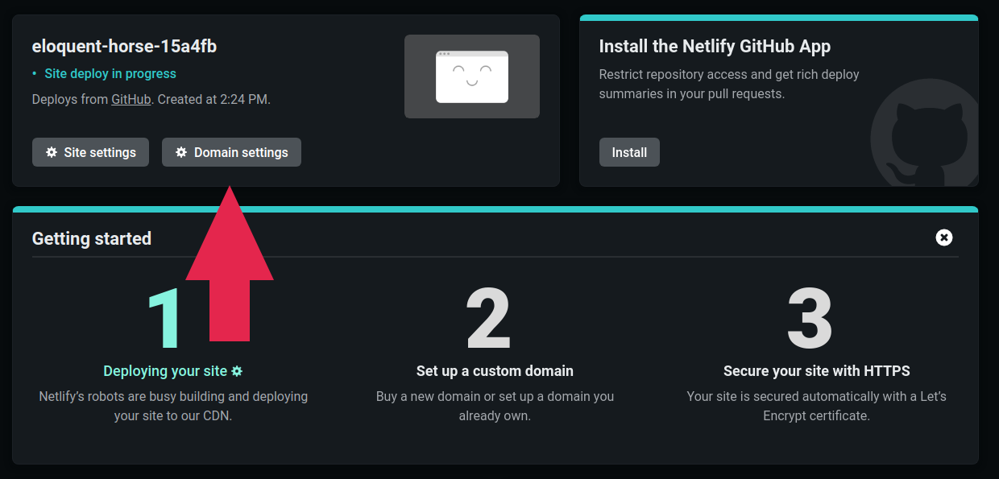

其實 [官方的說明文件](https://wowchemy.com/docs/getting-started/hugo-github-quickstart/) 就寫的很清楚，我這邊也大致上順著帶大家走過一遍，如果有特別需要注意的地方我會再提醒大家～

首先先到 [Wowchemy 的模板選擇](https://wowchemy.com/hugo-themes/)，然後選一個喜歡的模板。我這邊以 *Academic Blog* 示範，點選 *START WITH ACADEMIC BLOG*。

點 Connect to GitHub 來連結到 GitHub 帳號。

如果成功連結的話就會來到這裡。在 Repository name 這邊輸入 blog。Netlify 會自動建立一個 repository，然後點下面的 Save & Deploy。如果你不清楚什麼是 repository 的話也不用擔心，因爲之後 Netlify CMS 會幫我們管理得好好的～

之後就要等它慢慢跑，不過在等的時候可以先點上面這邊的 Domain settings來設定我們的網址！

我們可以看到目前的網址是 eloquent-horse-15a4fb.netlify.app 這團鬼東西 @@，點右邊的 Options 然後 Edit site name 來把它改掉。

